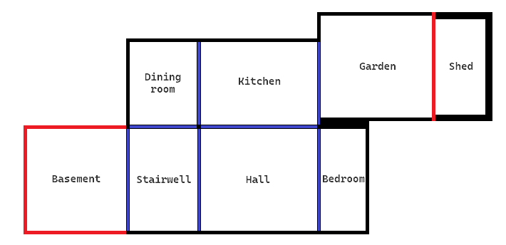

# Command Line based Adventure game

## User Guide

You will spawn in the Hall. 
You may move rooms by entering North, South, East, or West 
There may be items in the room, denoted by "The following items are in the room: ". These can be picked up with "Grab \<item>" 
There may be other things which you may be able to interact with using another item. To use an item type "Use \<item>" 
If you see a safe with a pin, you can open it with "Use Code \<code>" 
There are only 3 spaces in your inventory, therefore, to drop an item, type "Drop <item>" 
Monsters will also spawn randomly in various rooms. Some may follow you, others will not. To kill them, find an item that can deal damage and use it 

Note that capitalisation does not matter, but typos will not be automatically corrected by the program 

## Documentation

The following is the layout of the rooms. The house is randomly rotated (or the direction of North is randomly rotated - same effect). 
 
Red = locked doors, Blue = open doors 

### Files

main.cpp: Contains the main() function, setup() function, and use_item() function 
classes.h: Contains all classes used (with inline method functions) 
helpers.h: Contains helper functions prototypes and the print_vector() function (as it requires templates) 
helpers.cpp: Contains helper functions: help(), erase_monster(), capitalise(), strip(), and clean() 

### Functions

main(): contains main loop 
setup(): sets relations between each room (i.e. sets pointers between rooms based on compass direction) and randomly places items and monsters in rooms 
use_item(): contains logic for using each item with if else statements comparing the item selected and every other item 
help(): prints guide 
erase_monster(): removes the monster from the current room 
capitalise(): Converts string to Title Case. All strings used in the program are title-cased (apart from info in brackets), so the input is converted to Title Case 
strip(): Removes spaces before and after the input 
clean(): Removes non-alphanumeric characters from the string 

### Classes
Items: For any item.  
Each item has a name, may have a dependant (a non-item object which can be interacted with using an item), can deal damage to monsters, may affect player health (negative for dealing damage, positive for healing), may have a reciprocal chance of failure (labelled chance of failure), and may or may not be expendable. 

Monsters: 3 monsters exist: Buff Monster, Monster, and Minion 
Each monster has a name, hitpoints, damage dealt, and may be able to move 

House: For any room. 
Each room has a name, a list of items inside it, a hash map of compass directions to pointers to other rooms, a list of monsters inside it, and a list of non-item objects inside it 

### Stats

#### Stats for items:

- Medical bag: Heals 60 HP
- Old Revolver: Has a 1/3 chance of not firing. Deals 30 damage to one target.
- Knife: Deals 30 damage to one target. 
- Sword: Deals 50 damage to two target max. Only accessible through the chest.
- Grenade: Deals 70 damage to all targets in the room, and 10 damage to yourself.
- Shield: Protects you from attack, and following by any monsters for one round 

#### Stats for monsters:

- Monster: 50 HP, Deals 15 damage, does not follow you
- Buff Monster: 100 HP, Deals 15 damage, does not follow you
- Minion: 20 HP, Deals 5 damage, does follow you

### Walkthrough

1. Go to the kitchen. Make note of the number on the fridge magnet.
2. Go to the garden. Grab the sledgehammer, and use it to break down the shed door.
3. Make note of the number on the piece of paper.
4. Go to the bedroom. Use the code as described in the user guide to open the safe and receive a USB stick.
5. Use the USB stick on the laptop to open the electronic lock on the basement doors.
6. Go to the basement and escape (go any direction from there but the direction you came from)  
You may also retrieve the key from the bedroom to open the chest in the Hall and receive a sword.